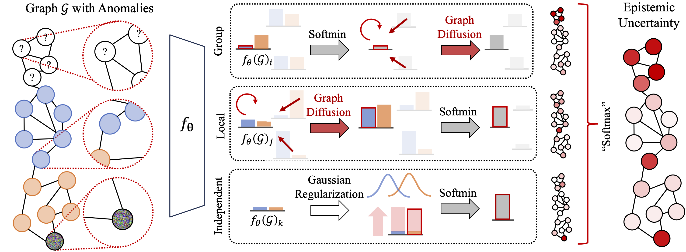

# Graph Energy-Based Model


Reference implementation of the Graph Energy-based Model (GEBM) from [Energy-based Epistemic Uncertainty for Graph Neural Networks](https://scholar.google.com/citations?view_op=view_citation&hl=en&user=K-egQS0AAAAJ&citation_for_view=K-egQS0AAAAJ:d1gkVwhDpl0C) by Dominik Fuchsgruber, Tom Wollschläger and Stephan Günnemann pubished at NeurIPS 2024.


## Installation

This code and its dependencies can be installed as the package `graph_uq` via

```bash
pip install -e .
```

## Using GEBM in Your Code: Wrapping GEBM

We provide a simple to use wrapper you can use in your codebase to include GEBM as an uncertainty model. It can be imported as as

```python
from graph_uq.gebm import GraphEBMWrapper

gebm = GraphEBMWrapper()
gebm.fit(logits, embeddings, edge_index, y, mask_train)
gebm.get_uncertainty(
    logits_unpropagated=logits_eval_no_network,
    embeddings_unpropagated=embeddings_eval_no_network,
    edge_index=edge_index,
)
```

Its `fit` and `get_uncertainty` methods fit to training data and evaluate on inference data respectively. Minimal working examples are provided in `example.ipynb`. You can also use part of our framework to implement datasets and / or models and then run GEBM (see the notebook).


## Running Experiments

This code is built on the [sacred](https://sacred.readthedocs.io/en/stable/) and [seml](https://github.com/TUM-DAML/seml/tree/master) frameworks. The latter is only for convience to run experiments on a HPC cluster and only the former is required to run experiments. We use sacred's `named configurations` to configure experiments conveniently.

### Configurations

The default configurations for datasets, models and uncertainty estimators are found in `graph_uq/config`. Named default configurations are decorated with `@experiment.named_config` and are all found in `graph_uq/config/default`. To run an experiment, we recommend using `main.py`. For example, to run an experiment on CoraML:

```bash
python main.py with gcn cora_ml leave_out_classes logit_uncertainty softmax_uncertainty multi_scale_conditional_evidence_ebm data.setting=inductive data.num_splits=5 model.num_inits=5
```

The named configurations in this example are:
- `gcn` : The model backbone.
- `cora_ml` : The dataset.
- `leave_out_classes` : The distribution shift. 
- `logit_uncertainty`, `softmax_uncertainty` : Runs baseline uncertanties for logit-based EBMs
- `multi_scale_conditional_evidence_ebm` : Runs our method, GEBM
- `data.setting=inductive` : Specifies inductive node classification.
- `data.num_splits=5`,  `model.num_inits=5` : Specifies how many splits and initializations experiments are repeated over.

One can also print the resulting full configuration by running:

```bash
python main.py print_config with ...
```

The scripts `generate_data.py`, `train_model.py` and `evaluate_model.py` cache the corresponding intermediate results and are useful for large scale experiment grids. The main file `main.py` implements the functionality of all three and composes them in an easy-to-use way.

### Datasets, Distribution Shifts, Models, Uncertainty Methods

These are all possible datasets and dist

Datasets: `cora_ml`, `citeseer`, `pubmed`, `amazon_computers`, `amazon_photo`, `reddit`, `cora`, `cora_ml_lm` (CoraML with LLM features), `coauthor_physics`, `ogbn_arxiv`, `coauthor_cs`

Distribution shifts: `feature_perturbations` (includes all settings in the paper), `leave_out_classes`, `homophily_shift`, `page_rank_centrality_shift`

Models: `gcn`, `gat`, `sage_no_normalize`, `gin`, `mlp`, `appnp`, `gpn`, `bgcn`, `gdk`, `sgcn`

You can add these named configurations additionally to obtain Bayesian uncertainty estimates for your model using Monte-Carlo (use the `mc_uncertainty` option jointly): `ensemble`, `mc_dropout`, `mc_dropedge`

Uncertainty Estimators: `heat`, `mc_uncertainty`, `evidence_uncertainty` (for evidential methods like SGCN, GDK, GPN), `logit_uncertainty`, `softmax_uncertainty`, `multi_scale_conditional_evidence_ebm` (GEBM)

### Logging and Results

By default, results are logged onto the hard drive to `runs/{db_collection}/{overwrite}`, where `db_collection` and `overwrite` correspond to the collection and experiment id from `seml` (and are set to `None` if the code is used from the CLI). You can also overwrite this directory with `output_base_dir={your_dir}`. Each run will create:
- `config.pt`: Configuration dict for this run
- `logs.json`: Running metrics during model training.
- `results_aggregated.pkl`: All evaluation metrics of this run (see below).

Each run will also visualize the evaluation results (e.g. ood-detection, misclassification detection, calibration, ...) as a human-readable table. Some uncertainty methods provide multiple uncertainty estimates, each of which will be evaluated. For example, GEBM creates 8 uncertainty types, depending on whether diffusion is used, the input logits are in the presence/absence of structure and whether the embeddings are in the presence/absence of structure. The suffix that corresponds to the settings reported in the paper (evaluation on logits & embeddings that in the *absence* of structure) is `/multi_scale_corrected_conditional_ebm/msceebm/_embeddings_unpropagated_logits_unpropagated`.

## Citation
Please cite our paper if you use our method or code in your own works:
```
@article{fuchsgruber2024energy,
  title={Energy-based Epistemic Uncertainty for Graph Neural Networks},
  author={Fuchsgruber, Dominik and Wollschl{\"a}ger, Tom and G{\"u}nnemann, Stephan},
  journal={arXiv preprint arXiv:2406.04043},
  year={2024}
}
```